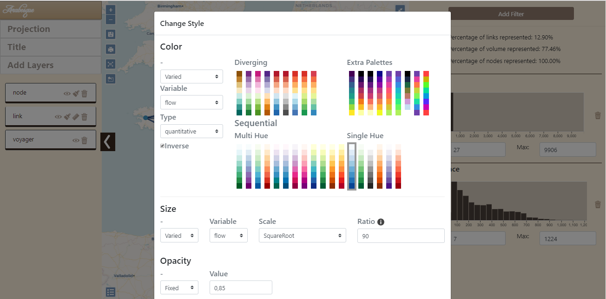

```{r, include = FALSE}
knitr::opts_chunk$set(
  collapse = TRUE,
  comment = "#>",
  echo = FALSE,
  warning = FALSE
)
```

<!--
Notes:
# Reminders:
- abstract due date : 08/03/2021
- informations: https://2021.foss4g.org/call-for-papers/academic.html
- 20 min presentation, 5 min question, 5 minutes room change : 30 minutes slots

- topics: Open Geospatial Software, Open GIScience
- FOSS4G 2019 presentation: https://media.ccc.de/v/bucharest-205-gflowiz-an-open-science-framework-to-analyze-and-geovisualize-networks-and-flow-datasets
- SAGEO 2019 proceedings: https://sageo2019.inrae.fr/actes/
- FOSDEM demo : https://archive.fosdem.org/2020/schedule/event/arabesque_a_geographic_flow_visualization_application/

<!--
Notes:
-> combien de signes (mots) pour le proceeding ?
-> Faut-il écrire en français ou en anglais ?
-> est-on limité par le nombre d'images ou d'illustrations ?
-> ce serait bien de préparer un exemple sur des jeux données. On prend lequel ?
-->


# Keywords {-}

Open Geospatial Software, Origin-Destination Matrix,
Spatial Network, Geoweb, Flow Mapping

# Abstract {-}

Arabesque is an application for the exploration and geovisualisation of
origin-destination flows (or spatial networks), developed within the
framework of the Univ. Gustave Eiffel (ex. IFSTTAR)-funded research
project geographic flow visualisation (gflowiz)
[geoflowiz](https://geoflowiz.hypotheses.org/), in collaboration with
the CNRS. It allows both the exploration and the filtering of OD data
and their representation, with a strong emphasis on geographic
information layering and features\' semiology. The key-objective is to
propose an easy way to produce a modern cartography (a geovisualisation)
of thematic flows (e.g. bilateral flow volume), at several geographic
scales, even from your own datasets. The objective of this article is to
position Arabesque in the range of geoweb applications for producing
flow maps, by comparing its functionalities with those of similar web
applications--- Magrit, [Kepler.gl](http://kepler.gl/),
[flowmap.blue](http://flowmap.blue/) ---pointing out their respective
advantages and limitations. The analysis of its functionalities is
compared on the same flow dataset--- MOBSCO, i.e. a dataset describing
the school mobility of French pupils and students on a given year ---for
a practical and empirical \"validation\" of its contributions. We
demonstrate that the configurations and appearances of these tools'
visual output depend largely on the culture of their developers, and on
the use and audiences for which they have been developed. 


# [Introduction]{.smallcaps} 

Arabesque is a Web application for the exploration and geovisualisation
of origin-destination (OD) flows. Its ongoing development since 2018
comes at the same time as several other new online flow mapping tools.
These new online tools are part of the same family within the wider
universe of existing IT solutions for mapping relational and
origin-destination data. Within this family of online tools, there is a
certain variety: some are aimed at a wide range of users, and others are
more specific and aimed at more specialised audiences. Most of them
share the fact that they rely on common and open data-visualisation,
mapping and geo-processing libraries of functions. However, only some of
them are entirely free and open-source, as is Arabesque. The objective
of this article is to position Arabesque in the range of geoweb
applications for producing flow maps, by comparing its functionalities
with those of comparable applications, pointing out their respective
advantages and limitations.

To provide a practical and empirical \"validation\" of Arabesque
contribution and specificity, we first select a small number of flow
mapping tools sharing common characteristics with Arabesque and second,
compare these tools using the same flow dataset: MOBSCO, i.e. a dataset
describing the school mobility of French pupils and students on a given
year. In doing so, we highlight the complementary effects between these
tools which, for the same set of data, make it possible to obtain
different types of representations. Those configurations and appearances
depend largely on the culture of the developers of these tools, and on
the use and audiences for which they have been developed. The
differences between these tools bring out two different cultures: that
of thematic mapping and statistical analysis of information and the more
\'dataviz\' oriented culture of information exploration. We think that
this dividing line is somehow reminiscent and related to the one
described and analysed by Carmichael and Marron between data science and
statistics (2018).

# The small world of Origin -- Destination matrix mapping

## The development of online web mapping tools

There are currently a growing number of computer solutions for mapping
flows and origin-destination (OD) matrix with one\'s own data. According
to their environment, these tools can be classified into 3 main
families: 1) desktop GIS softwares (e.g. QGIS, ArcGIS); 2) programming
languages with (geo)data analysis capabilities (e.g. Python/R); 3)
online tools with user-friendly interfaces.

As demonstrated in a recently published paper (Bahoken *et al*., 2020),
the latter category has tended to develop further in recent years. This
dynamics is concomitant with and part of a wider phenomenon: the rise of
the geoweb (Hackley *et al*., 2008; Mericksay and Roche, 2011). But
among online mapping tools, flow mapping tools tended to emerge in
greater numbers from the mid-2010s onwards, taking advantage of the
opportunities offered by the release of feature libraries such as D3
(Botstock et al., 2011) and new technologies such as WebGL or vector
tiles that opened up a range of new possibilities for online graphics
and mapping. The growing attraction to open source tools and replicable
approaches in the world of mapping and geomatics also fostered this
dynamic (Giraud and Lambert, 2017).

In a recent contribution, Bahoken (2020) provided a review of about 80
flow-mapping web applications resulting from a digital curation. Among
all these applications, only a minority are offering users the
possibility of importing, analysing, exploring and mapping their own
dataset. The majority of retrieved applications only allows the
exploration of a preselected dataset on a certain thematic (i.e. global
trade, urban mobilities, migration flows, scientific collaboration).

## Flow mapping tools

Among the 80 web applications listed in that review of flow map, 8 have
the particularity of allowing users to import their own dataset, as does
Arabesque. There are Kepler.gl, Magrit, Flowmap.blue, Tableau, CARTO,
Flourish, ArcGIS Online, and NETSCITY. Of course, this list of online
flow mapping applications might not be exhaustive and is open to
suggestions to enrich it.

To this purpose, the fruits of the above-mentioned review of web
applications for flow mapping are shared in the form of a collaborative
dashboard open to any contribution. Possible contributions to this
collaborative work of digital curation can be modifications or
enrichment of metadata, addition of new applications and of course reuse
in the context of other research (the paper: Bahoken et al., 2020; the
dashboard: Le Campion and Nguyen, 2019).

While many of the tools identified are based on open-source
data-visualisation, mapping and geo-processing libraries, they do not
all have the same degree of accessibility, as shown by Table 1. Among
these 8 flow mapping web applications we identified for the study, only
4 are entirely free and open: Arabesque, Kepler.gl, Magrit, and
Flowmap.blue.

In the perspective of comparing Arabesque to tools in the same category,
and in the logic of presenting in this article research results that are
themselves as open and reproducible as possible, we have decided to
operate our benchmark on those 4 applications (developed between 2017
and 2019). Thus, the main criterion that allowed us to choose the
applications finally retained for the test is their accessibility.

  ------------------------ ------------------- ------
  Flow mapping web tools   FOSS4G compliance   
                           open                free
  Kepler.gl                yes                 yes
  Magrit                   yes                 yes
  Flowmap.blue             yes                 yes
  Tableau                  no                  no
  CARTO                    yes                 no
  Flourish                 no                  yes
  Arabesque                yes                 yes
  ArcGIS Online            no                  no
  NETSCITY                 not yet             yes
  ------------------------ ------------------- ------

**Table 1**. Software licensing of a selection of online flow mapping
tools

While it also allows users to map their own data, NETSCITY has the
particularity of being more specifically designed for mapping science
data (i.e. scientific collaborations). Moreover, being still in beta
version, the code sharing operation of this application is not yet
finalized; thus justifying excluding it from the following comparison
with Arabesque.

## The MOBSCO dataset

To perform our comparison of Kepler.gl, Magrit and Flowmap.blue with
Arabesque, we selected a flow dataset that will be visualized in each
software. For this purpose, we choose a dataset which remains little
known. It is the detailed file of the French population census
describing the school mobility of individuals and, more specifically,
commuting to and from the place of study
([MOBSCO](https://www.insee.fr/en/information/2569735)). In spite of its
great thematic interest for mobility researchers in France, it has not
been the object of much exploitation and valorisation until now.

It is a product of the French National Institute for Statistics and
Economic Studies (INSEE) and is available online. It comprises two
sorting variables: the municipality of residence and that of the place
of study (including in bordering countries). Its scope encompasses
individuals enrolled in an education establishment and aged 2 years or
over. The source file contains 4,730,521 records and 22 variables. For
each statistical individual, it lists its municipality of residence, its
place of study, its age group, and highest diploma, the
socio-professional category of the households he belongs to, the number
of persons and cars of the households.

The size of the dataset being too large for online flow mapping tools,
we preformatted and aggregated it at the departmental level (higher
administrative level than municipalities). We also filtered the data to
only keep records for students only (higher diploma is at least the
*baccalaureat*), because they are more likely to move outside their
municipality of residence to study. The final dataset contains 27090
records. In addition, we used the ADMINEXPRESS database of 24-09-2019
provided by the French National Geographic Institute (IGN) for the
departments' georeferencing. We limited our analysis to the France
metropolitan area. The nodes were created by calculating the centroids
of the departments.

# Benchmarking/ Use test

In this section, we are testing 4 flowmap geoweb tools for OD flows that
are interfaced on the web, with the same dataset, in order to compare
them, both in terms of ergonomics and rendering.

The objective is to position Arabesque in the range of geoweb
applications for producing flow maps, by comparing its functionalities
with those of comparable applications, pointing out their respective
advantages and limitations.

Another interest of this comparative approach is to show the dependence
of the rendering: from the type and style of the map to the tool. This
dependence is also linked to the audience for which the application is
intended, depending on whether its interest will be focused on the
exploration and analysis of cartographic data or on cartographic
editing. In the first subsection, we introduce the 4 applications, their
specificities, the audience and use type for which they were developed.
In the second subsection, we present the result of the comparative test
we performed with the MOBSCO dataset, and in the third subsection we
present a summary diagram showing the specificities of each application
at each step of the data processing chain, from data pre-formatting to
exporting, including the different analysis options available.

## Presentation of the flow mapping web applications

### **Arabesque**

Arabesque is an application for the exploration
        and geovisualisation of origin-destination flows (or spatial
        networks), developed within the framework of the Univ. Gustave
        Eiffel (ex.IFSTTAR)-funded research project geographic flow
        visualisation (gflowiz) geoflowiz, in collaboration with the
        CNRS. Its development benefits from several well known
        open-source data-visualisation, mapping and geo-processing
        libraries (OpenLayers, D3, TurfJS) and build also upon well known open data-sets (OpenStreetMap, NaturalEarthData)
It allows both the exploration and the filtering of OD data and their
representation, with a strong emphasis on geographic information
layering and features\' semiology. The key-objective is to propose an
easy way to produce a modern cartography (a geovisualisation) of
thematic flows (e.g. bilateral flow volume), at several geographic
scales, even from your own datasets. Arabesque main public is academia
(researcher and students) but with the objective to be simple to use for
anyone. Arabesque was launched in 2019 by Côme E. (2019) under a BSD
2-clause licence.

### **Kepler.gl**

Launched in 2018, Kepler.gl is an open source
geovisualisation tool designed for complex datasets (large,
spatio-temporal, 3D). Built with Deck.gl (Wang, 2019), Kepler.gl uses
WebGL to display large data sets in multiple forms quickly and
efficiently. For example, it provides dot maps, choropleth maps,
heatmaps, clusters or even 3D grids (He, 2020). Developed by the
technology company Uber, this application allows both exploring and
mapping large and complex geographic datasets thanks to client-side
rendering. All layer geometry calculations are GPU accelerated, smoothly
rendering millions of points and making kepler.gl a much more powerful
web tool than traditional mapping software and other web mapping
solutions. The target audience is that of data journalists and data
scientists whose objective is above all to explore large data sets and
not to correctly represent flow logics. Kepler.gl is available under a
MIT licence.

### **Flowmap.blue** 

This web application was firstly launched in
2019 by Boyandin I. (2019). Only developed in JavaScript using
flowmap.gl, deck.gl, mapbox, d3, blueprint and CARTOColors, the tool is
designed to explore and create flow maps from Google Sheets or tabular
data in a web browser. Additional tools are also available such as
geocoding, matrix converter (wide / long formats). Flowmap.blue allows
automatic clustering, provides global data filtering and automatically
adapts the scales of the flow thickness and colors. The tool is however
limited in its style, the type of flow map that can be made and the
projection proposed. It's prime objective seems to allow the production
of a nice flow map easily and very quickly, in response to the
requirements of data journalists and data scientists. Flowmap.blue is
also available under a MIT licence.

### **Magrit** 

This thematic web mapping application was launched
in 2017 (Viry *et al.*, 2018). It is free under the CeCILL licence and
compatible with the GNU GPL. Mainly developed in Python and modern JS
(ES6) Javascript using notably the d3.js library, its code is already
open. Magrit is mainly intended for social scientists and thematic
cartographers as it is firstly designed to teach statistical
cartography, respecting the rules of cartographic semiology (Bertin,
1967). To do so, it offers 12 types of maps (e.g. choropleth and
smoothed choropleth, proportional symbols, waffle, cartogram,
discontinuity) according to different projections. One of them allows to
represent flows, but in a reduced version: only in the form of hub lines
with weighted symmetrical links.

##  Use test of the flow mapping web applications

As said before, we loaded the dataset we subsetted from the MOBSCO
dataset.

Then we perform some manipulations in order to test the filtering and
rendering capabilities of each software. The figures from 1 to 7 show,
for each application, its interface and the final result obtained. In
order to highlight the capabilities of each software, we have chosen not
to show the default displays, which are generally quite unreadable with
OD data and have preferred to highlight maps that are more elaborate.

### **Arabesque** 

Arabesque starts by loading the links data, and
    allows the user to specify ID columns, the flow (called *volume*)
    column and, if needed, an aggregation function. The next step
    consists in loading location data or to use a preset location
    dataset. When joining the two datasets, it will display a message
    indicating how many links were removed if the location of a node is
    not available (i.e. missing data).

{width=100%}

**Figure 1**. Arabesque Interface

As shown in Figure 1, Arabesque is divided in 3 parts:

- the layer panel at the left,

- the data handling panel at the right,

- the map is in the middle

The layer panel offers functionalities to add, remove and organize
layers. From there, you can change the map projection (default is
webmercator but others are available) or the title of the map. For each
layer, if available, you can access customisation panels (see Figure 2)
to change the colour scale, the links shape and size, etc.

The right panel is dedicated to the data. By default, a histogram
represents the distribution of the flows. It is also a *graph query*,
i.e. a sliding window that can be adjusted to display only a portion of
the distribution. This is shown in Figure 3, where only the flows
greater than 100 are displayed. Figure 3 shows another *graph query* on
distance. Arabesque allows the user to define his own filters on the
loaded data but also on the automatically created indicators, like, for
example, the distance (link size) shown in Figure 3. In the 4
applications reviewed here, Arabesque is the only one to propose that.

{width=100%}

**Figure 2**. Styling in Arabesque.

{width=100%}

**Figure 3**. Exploration with Arabesque.

Finally, in the center, the map displays the layers with the chosen
symbology according to the filters defined in the data panel.

###  **Kepler** 

In terms of flow mapping, Kepler.gl offers two rendering
    modes for data origins destinations, arcs and lines. On the one
    hand, the arc mode draws an arc between two points to represent a
    link in 3D. The higher arc represents the greatest distance. Line
    layers are the 2D version of arc layers (flat on the map). The
    symbology of arcs and lines can be customized in terms of line
    stroke and colour and is based on a variable (Figure 4).

{width=100%}

**Figure 4**. Kepler.gl interface

This method of cartographic design involves applying an angle to the
line to turn it into a curve, giving it a more aesthetic appearance (Gu
et al., 2018). With 3D, this curvature of the line can be combined with
an elevation, which allows the flow to be represented differently
(Dorling, 1991). In terms of interactivity, this mode of representation
is accompanied by interesting features, such as the selection of a
subset of data relating to a departure or arrival area by hovering over
the map (brushing), as shown on Figure 4.

4.  **Flowmap.blue:** The optimal import of data into flowmap.blue is
    done with a googlesheet composed of 3 sheets (map properties,
    locations, flows), a minimal template is proposed. Flowmap only
    allows you to make a flow map. In the interface (Fig.6.), it is
    possible to filter by origin or destination as well as to modify the
    style of the flows and in particular to animate and cluster them.

Flowmap.blue can be efficient for data exploration thanks to its
interactivity and the display of toolboxes on locations and flows.

Other customization options are possible but require a mastery of
Mapbox, and are to be integrated in the \"properties\" page of the
googlesheet (background modification, filtering by feed directions\...).
Flowmap.blue also offers a "simplified" approach with a data import page
focusing only on locations and flows, via the website.

{width=100%}

**Figure 5**. Flowmap.blue interface.

### **Magrit**

Magrit requires an upload in two parts: the geographical points dataset,
and the links data. With OD data, Magrit allows to create a single type
of map, links between points, but with the option to filter the small
links and to group the lines into classes.\
After the initial configuration of the map, the user can adjust the
style of the representation: colour and size of the links, overall
design of the page (titles, mentions, scale bar...).

{width=100%}


**Figure 6**. Magrit interface

As shown in Fig. 6, Magrit provides some advanced features to build the
map: several discretization modes, number of classes and their limits.

# Summary diagram

We tried to present in a synthetic way the different steps involved by
the flow mapping web-tools to explore a flow dataset. These steps are
organized in five main tasks: data pre-processing, data processing,
mapping, exploration and export. The diagram (Figure 8) therefore shows
the workflow of a flow map from data to a finalized map and the
functionalities offered by each application at each step. To complement
this synthetic view, we detail in the next paragraphs the main
differences between the functionalities offered by the tools to perform
these five main tasks.

{width=100%}

**Figure 7**. Applications workflows diagram.

## **Data pre-processing**

The pre-processing step does not take into account the data preparation
that has to be done by the user, in order to load them in the
application. It concerns the processing of the uploaded data by the
application to make it conform to its internal data model.

In most applications the data must be provided in the form of two data
sets:

\- location data (here called *geodata*), which correspond to the
starting and ending points of the flows, i.e. *nodes*.

\- the link data, which concerns the flows between the nodes.

Note that, with the exception of Kepler.gl which takes only one data
source, most tools use two different files or tables (one for the nodes
and the other for the links).

To spatialize the nodes, there are two cases. The most common is to
provide geographic coordinates (latitude and longitude) in the *WGS84*
coordinate reference system. Another case allows an automatic geocoding
of the nodes if in the link file, the identifiers correspond to a known
nomenclature already present in the application (e.g. ISO2 UN code for
countries). It is then possible to load only the link data and to
indicate to which nomenclature the data belong. The links data are then
loaded into the application.

The Arabesque application allows you to choose an aggregation function
that will be used if several links share the same Origin and
Destination.

## **Data processing**

Once integrated, the flows and the spatial data are joined in an
Origin-Destination matrix to be processed. Depending on the data, the
resulting matrix can be asymmetric, the flows will be directed. If it is
symmetrical, the flows will not be directed. Arabesque manages both
types of flows. Flowmap.blue handles only directed flows while Magrit
and Kepler.gl considers that the flows are not directed. This is an
issue because only the most important outgoing flow between two nodes is
represented. This limitation will prevent a fine analysis of bilateral
flows.

Some tools calculate new indicators. Arabesque automatically calculates
the flow distances and common graph statistics for the nodes: inbound
and outbound degrees and balance (weighted by the flows or not).
Flowmap.blue automatically calculates a new indicator that is used for
its clustering function, but these new values are not accessible to the
user. Magrit may calculate new values using an expression entered by the
user. Arabesque and Magrit can also compute descriptive statistics
(mean, median, etc.) and a distribution histogram of all the features
(computed or imported).

## **Mapping**

Once the Origin-Destination matrix has been created and the possible
indicators calculated, the software will produce the representation. It
will then be customizable or not. Arabesque and Kepler.gl allow for
further styling of the map whereas Flowmap.blue allows only one type of
representation. Magrit proposes several representation modes but only
allows the link map for OD data. Arabesque and Magrit offer advanced
graphic styles, i.e. it is possible with these tools to modify the style
of the links (shape, colour, orientation). Background information can
also be added to the map to provide context, either from web resources
(Arabesque, Flowmap.blue, Kepler.gl) or from vector files provided by
the user (Arabesque, Kepler.gl, Magrit). Note that only Arabesque and
Magrit allow to change the map projection. Flowmap.blue and Kepler.gl
are limited and can only produce maps in Web Mercator projection. This
may be useful for flow data analysis with global datasets but for local
datasets a local projection might be wanted for mapping.

## **Exploration**

The data exploration possibilities are, along with the
representation/styling possibilities, where the softwares differ the
most. The four applications studied in this article offer data sorting
and ordering functions. But some features are specific to certain
applications. Flowmap.blue, Kepler.gl and Magrit offer functions to
display labels and tooltips to provide information about the objects
studied. This is a feature missing in Arabesque.

Arabesque and Kepler.gl offer an interesting feature for data
exploration: the *graph query*. By manipulating a window on a graph,
this feature allows to hide part of the data in order to highlight the
data included in the window.

Kepler.gl also offers a brushing function (*brush*), which displays only
the links present in a radius around the cursor, the other data being
hidden. Again, this feature can be useful in an exploratory context or
during a demonstration.

Finally, Flowmap.blue offers an original feature of spatial aggregation
(*clustering*), that allows to easily explore the flow at different
spatial scales. This aggregation is possible thanks to the calculation
of an indicator, not accessible to the user, which allows to
aggregate/disaggregate the flows when zooming. Everything is done
automatically by the application, the user can activate or deactivate
the functionality or choose one of the available aggregation levels. The
number of aggregation levels is calculated according to the data by the
application.

## **Export**

The export functionalities are also very diverse. The studied
applications, with the exception of Flowmap.blue, offer the possibility
to export the map in raster (PNG, JPEG) or vector (SVG) image formats.
Kepler.gl and Flowmap.blue also offer an online hosting service in order
to publish the map on the Web. Arabesque, Kepler.gl and Magrit allow you
to save and export your project data and settings in order to be able to
reload them afterwards. This is useful to be able to continue the
analysis later or share it with a third party and is a great benefit for
reproducibility.

# [Discussion]{.smallcaps}

This comparison shows that these four solutions have different
functionalities, flow maps forms and styles. Overall, each tool meet
specific needs according to the profiles (technical skills, mapping
knowledge) and objectives (communication, exploration, mapping) of the
different users (geographer, cartographer, GIS specialist, data
scientist, data journalist, urban planner, etc.).

We would like to highlight some elements that might help the user to
choose between these tools for a specific task.

## Rigor vs design

From the same type of data (OD), these 4 applications based on offer
quite varied representation modes (hub lines, arcs, arrows, curved
lines). The cartographic "rigor" is not supported by all the tools in
the same way and from the same perspective. Arabesque and Magrit,
developed by cartographers, are intended for \"informed\" audiences who
are more \"rigorous\" in terms of graphic semiology. Flowmap.blue and
Kepler.gl offer less rigorous but more aesthetic modes of
representation, whose design is in line with current trends in online
cartography and infoviz.

## Analysis, exploration or representation?

Beyond the types of maps, these online applications mainly refer to
three types of approaches around flow data: analysis, representation and
exploration. Arabesque is the only application offering some flow data
analysis functionalities (multivariate filtering, aggregation, selection
on distances, network analysis indicators). The exploration dimension
through dynamic data interaction (filtering, brushing, hovering) is at
the heart of Kepler, Arabesque and Flowmap.blue. In these three
interfaces, the user can move around, zoom in, and query elements.
Magrit, on the other hand, is more focused on the production of static
maps but do not allow navigation and exploration.

## Performance 

These four applications based on different technologies (D3, DeckGL,
MapboxGL) do not offer the same performance in terms of data integration
and representation. Because of the use of WebGL and vector tiles,
Kepler.gl and flowmap.blue can handle large volumes of data. On the
other hand, Magrit and Arabesque are based on D3 javascript technology
and have limitations with datasets of several thousand objects.

## Interoperability and reproducibility

About the data preparation, 3 out of 4 tools are using data formatted as
two separate tables: one for the nodes (geographical points) and one for
the links (thematic information). Kepler.gl is apart, it uses a single
data table. All the 4 tools can read data with an open format, CSV or
GeoJSON. FlowMap.blue imports data hosted in a Google Docs table. It is
possible to paste CSV formatted data into the browser tab, but this
option renders the project not hostable in the Flowmap.blue website.

Depending on the tools, the dissemination possibilities are very
different. While some tools (Kepler.gl, Flowmap.blue) offer to host the
results online, others (Arabesque, Magrit) offer to export the map as an
image. The choice of the tool can therefore be based on the intended
purpose of its use: a dynamic web map or a static illustration for a
scientific article or report.

The capability to export the parameters of a project can then constitute
a real bonus to transmit the whole work to collaborators and contribute
to ease the reproducibility of the analyses.

In 2016, an experiment reproducibility issue has been identified (Baker,
2016). If it is sometimes very difficult to reproduce exactly the
conditions of an experiment. Using open source tools can help to attain
*Computational Reproductibility* (Leonelli, 2018), as when data are
shared, anyone can reproduce the results. Arabesque, Kepler.gl and
Magrit are interesting in this regard. The export function of these
tools integrates both the data and the project parameters, making it
possible to reproduce the map.

All the tools are open source and their code is auditable. Their
processing and data visualization algorithms can therefore be inspected.

## Purpose

Among the four tools tested:

1\. Kepler and Flowmap.blue are intended for an audience wishing to
explore data without the desire to perform statistical analysis and the
intention to produce and export a thematic map.

2\. Magrit is intended for the realization and production of thematic
maps and allows statistical processing to be carried out beforehand.

3\. Arabesque is at the interface of these two typical uses: it offers
powerful exploration functions, visual parameterization of figures, and
statistical analysis possibilities. However, the export and captioning
functions needed to produce thematic maps in Arabesque are still
limited.

4\. Arabesque, like Flowmap.blue, is designed for flow maps. Kepler.gl
and Magrit are more generalist and offer other representation modes for
other datasets.

5\. Arabesque and Magrit target the same audience of researchers and
students and come from the same school of French cartography (in the
line of Jacques Bertin). Magrit\'s more general approach allows it to
attract a wider audience.

6\. Flowmap.blue and Kepler aim more at producing something quickly
communicable and are very web publishing oriented.

# [Conclusion]{.smallcaps}

This article highlights the specificities of Arabesque within the small
ecosystem of web applications for mapping flows. Rather than
highlighting the flaws and qualities of each tool tested, we observe
that these tools meet distinct user needs. The style and type of map
produced, the target audience, and the technical skills required to use
these applications differ interestingly. Having tested these software on
the same dataset, this complementarity is clearly visible.

In the end, the business culture, the user\'s skills and the final use
of the map influence the choice of the tool because it will influence
the chosen approaches (exploration and/or analysis) and the expected
purposes. Our contribution points out the strengths and limitations of
each in order to make an informed choice.

This demonstration also shows that the data does not influence the
choice of the tool since all of them worked with the same data set.

Only the formatting will change, which requires the user to be familiar
with the format required by the target application and the means
necessary to format them.

We note that these applications have been developed in the space of a
few years, taking advantage of the rise of geospatial technologies in
the web browser. A whole range of needs and possibilities are covered,
for the benefits of the community.

# [References]{.smallcaps} {-}

Bahoken F., Le Campion G., Maisonobe M., Jégou L., Côme É., 2020.«
Typologie d'un geoweb des flux et réseaux / Typology of a flow and
network geoweb », Géomatica Journal,
[[cdnsciencepub.com/doi/abs/10.1139/geomat-2020-0007;
doi.org.10.1139/geomat-2020-0007]{.underline}](https://cdnsciencepub.com/doi/abs/10.1139/geomat-2020-0007;).

Baker, M., 2016. 1,500 scientists lift the lid on reproducibility.
*Nature* **533,** 452--454.
[[doi.org/10.1038/533452a]{.underline}](https://doi.org/10.1038/533452a)

Bertin J. (1967), Sémiologie graphique. Les diagrammes. Les réseaux. Les
cartes, Paris/La Haye, Mouton ; Paris, Gauthier-Villars.

Boyandin I. (2019), Flowmap.blue, Geographic flows visualisation tool
for the people, in : CLISEL Conference Ascona 2019,
[[https://ilya.boyandin.me/talks/2019-03-03-clisel/]{.underline}](https://ilya.boyandin.me/talks/2019-03-03-clisel/)

Carmichael, I., Marron, J.S, 2018. Data science vs. statistics: two
cultures?. *Jpn J Stat Data Sci* **1,** 117--138.
[[doi.org/10.1007/s42081-018-0009-3]{.underline}](https://doi.org/10.1007/s42081-018-0009-3)

Côme E., Bapaume T., Jégou L., Bahoken F., Maisonobe M., Roelandt N., Le
Campion G. (2019), Arabesque, application d'exploration et de
géovisualisation de données de flux et de réseaux, in: Actes de la
conférence internationale de géomatique (SAGEO'2019), Session stockages
et flux, Clermont-Ferrand, 13-15 novembre 2019, pp. 265-264.
Actes\_Sageo2019.

Dorling, D. F. L., 1991. The visualisation of spatial social structure
(Doctoral dissertation, University of Newcastle upon Tyne).

Giraud T., Lambert N., 2017. Reproducible Cartography. In: Peterson M.
(eds) Advances in Cartography and GIScience. ICACI 2017. Lecture Notes
in Geoinformation and Cartography. Springer, Cham.
https://doi.org/10.1007/978-3-319-57336-6\_13

Gu, Y., Kraak, M.J., Engelhardt, Y., 2018. Revisiting flow maps: a
classification and a 3D alternative to visual clutter. Proceedings of
the Int. Cartogr. Assoc, 1, 1-7.

He, S., 2020. Data‐Driven Urbanism: The Balance Between Spatial
Intelligence and Design Craftsmanship. Architectural Design, 90(3),
86-93.

Le Campion G., Nguyen A., 2019. Dashboard for exploring web applications
of geographic flow and movements (DBgFlowiz), IFSTTAR, AME-SPLOTT /
COSYS-GRETTIA, and CNRS-UMR Passages.

Leonelli, S., 2018. \"Rethinking Reproducibility as a Criterion for
Research Quality\", *Including a Symposium on Mary Morgan: Curiosity,
Imagination, and Surprise* (*Research in the History of Economic Thought
and Methodology, Vol. 36B*), Emerald Publishing Limited, Bingley, pp.
129-146.[[doi.org/10.1108/S0743-41542018000036B009]{.underline}](https://doi.org/10.1108/S0743-41542018000036B009)

Viry, M., Giraud, T., & Lambert, N., 2018. Magrit: a new thematic
cartography tool. In Proceedings of the ICA (Vol. 1, p. 120).

Wang, Y. (2019). Deck. gl: Large-scale web-based visual analytics made
easy. arXiv preprint arXiv:1910.08865.

# [Appendix]{.smallcaps} {-}

Article code source :
[[https://github.com/gflowiz/article\_foss4g2021]{.underline}](https://github.com/gflowiz/article_foss4g2021)

Arabesque, Kepler.gl and Magrit exported projects :

[[https://github.com/gflowiz/article\_foss4g2021/tree/main/data/projects]{.underline}](https://github.com/gflowiz/article_foss4g2021/tree/main/data/projects)

Screenshots gallery:

[[https://analytics.huma-num.fr/Gregoire.LeCampion/galerie\_art\_foss4g/\#display=Galerie\_image\_Foss4G&nrow=2&ncol=4&arr=row&pg=1&labels=logiciel,lien&sort=id;asc&filter=&sidebar=&fv=]{.underline}](https://analytics.huma-num.fr/Gregoire.LeCampion/galerie_art_foss4g/#display=Galerie_image_Foss4G&nrow=2&ncol=4&arr=row&pg=1&labels=logiciel,lien&sort=id;asc&filter=&sidebar=&fv=)

Mobsco dataset:

-   documentation: : https://www.insee.fr/fr/information/2383297

-   -   file:
    https://www.insee.fr/fr/statistiques/fichier/4507779/RP2017\_mobsco\_csv.zip

ADMINEXPRESS dataset:

-   documentation: :
    https://geoservices.ign.fr/documentation/diffusion/telechargement-donnees-libres.html

-   -   file: :
    ftp://Admin\_Express\_ext:Dahnoh0eigheeFok@[tp3.ign.fr/ADMIN-EXPRESS-COG\_2-0\_\_SHP\_\_FRA\_WGS84G\_2019-09-24.7z.001
    
```{r render-presentation, echo = FALSE}
# Code chunk to generate presentation
# inspired by : https://stackoverflow.com/questions/65893350/add-pkgdown-html-to-site-articles-generated-by-rmarkdownrender
rmarkdown::render(here::here("presentations/FOSS4G2021_presentation.Rmd"), output_file = here::here("public/FOSS4G2021_presentation.html"))
message("presentation rendered")
```
